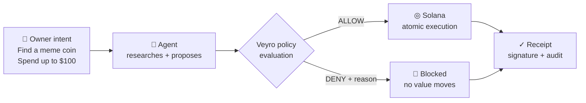
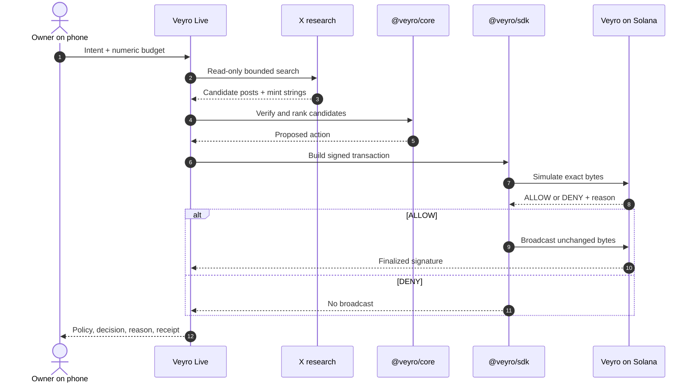
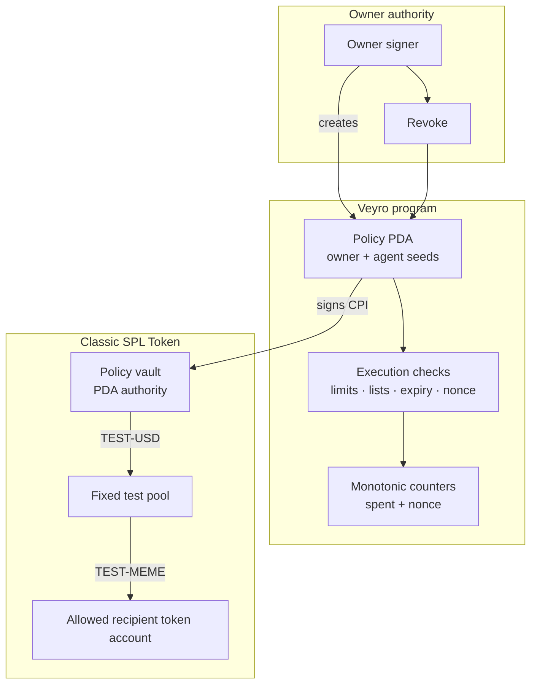
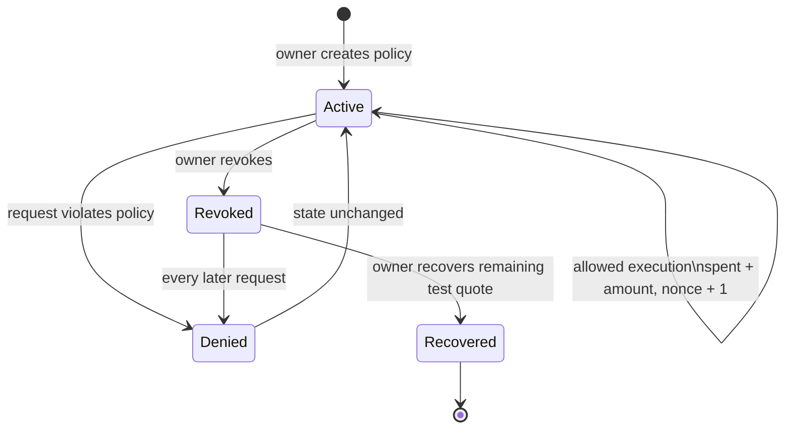
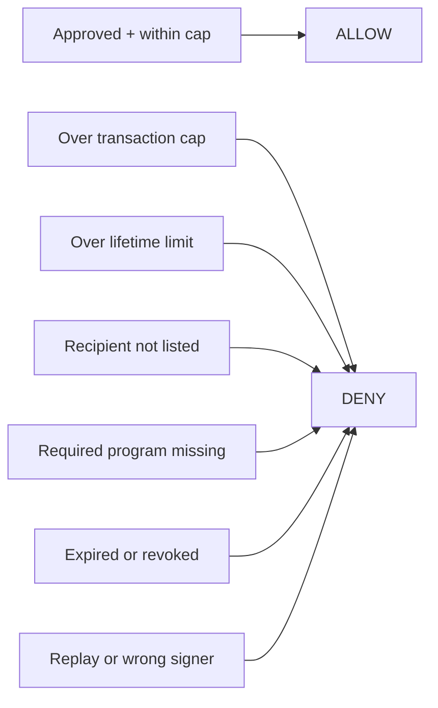

<div align="center">

# Veyro Protocol

### Authorization infrastructure for autonomous money on Solana

**Tell it what you want. Set the limits. Let it work.**

[](https://github.com/veyro-real/veyro-protocol/actions/workflows/ci.yml)
[](https://solana.com)
[](https://www.anchor-lang.com)
[](LICENSE)

[Live demo](https://veyro-live-production.up.railway.app) · [Architecture](docs/ARCHITECTURE.md) · [Threat model](docs/THREAT_MODEL.md) · [Validation evidence](docs/VALIDATION.md)

</div>

---

Veyro lets an owner give an AI agent a narrow, revocable spending mandate. The agent can research and propose an action. Value moves only when the proposed Solana transaction satisfies the owner’s on-chain policy.



## The policy boundary

| Owner control | Enforced behavior |
| --- | --- |
| Maximum transaction amount | One request cannot exceed the per-action cap |
| Cumulative spend limit | Successful spend only increases; it never resets |
| Allowed recipients | Up to 8 wallet authorities; an empty list denies all |
| Allowed programs | Up to 4 program IDs; an empty list denies all |
| Expiration | Chain time must remain before the deadline |
| Active / revoked state | Owner revocation blocks every later chain-ordered request |
| Replay nonce | A previously consumed request cannot execute again |
| Minimum output rate | The agent cannot weaken the owner’s output floor |

## How a request moves



The simulation is an explicit preflight decision. The program repeats enforcement during execution, where current chain state is authoritative.

## On-chain design



The current route is a deliberately narrow fixed-price pool for valueless test tokens. It validates token program identity, account ownership, mint, authority, initialized state, recipient authority, transaction shape and output. It is not a general CPI proxy.



## Repository map

```text
veyro-protocol/
├── programs/veyro/          Rust + Anchor enforcement
├── packages/sdk/            Transaction encoding, RPC and ALLOW/DENY preflight
├── packages/core/           Intent parsing and deterministic candidate ranking
├── scripts/                 Bootstrap, demo and adversarial chain verification
├── tests/                   SDK and policy boundary tests
└── docs/                    Architecture, threat model and evidence
```

## Deployment identity

**Program ID:** [`2Z7xH99Z4YvG4U2Ew5PUZtVh8FE1VRhQ1Mo9dFvRvS3Q`](https://solscan.io/account/2Z7xH99Z4YvG4U2Ew5PUZtVh8FE1VRhQ1Mo9dFvRvS3Q?cluster=testnet)

[Open in Solscan Testnet ↗](https://solscan.io/account/2Z7xH99Z4YvG4U2Ew5PUZtVh8FE1VRhQ1Mo9dFvRvS3Q?cluster=testnet) · [Open in Solana Explorer ↗](https://explorer.solana.com/address/2Z7xH99Z4YvG4U2Ew5PUZtVh8FE1VRhQ1Mo9dFvRvS3Q?cluster=testnet)

| Network | Status | Evidence |
| --- | --- | --- |
| Isolated local validator | **18 finalized actions passed** | [Machine-readable report](docs/verification/localnet.json) |
| Public Solana testnet | Funding and public deployment pending | [Deployment notes](docs/VALIDATION.md#public-testnet) |
| Solana mainnet-beta | Not deployed | Requires a reviewed live-market adapter and separately funded deployer |

The links above track the declared address. A visible address link is not proof that executable code is deployed. This table is the source of truth until public deployment receipts are added.

## Verified behavior



The local-chain suite broadcasts expected denials with preflight disabled. The deployed program must still reject them, produce the exact error, and leave every policy byte and token balance unchanged. Successful swaps must finalize with exact balance deltas and counter increments.

<details>
<summary><strong>Run the complete verification suite</strong></summary>

Requirements: Node 24+, Rust, Solana CLI and Solana SBF build tools. Anchor is a Rust dependency; the Anchor CLI is not required.

```bash
npm ci
npm run build
npm test
cargo test --workspace --locked
npm run build:onchain
npm run test:localnet
```

Every run creates isolated disposable keys and a fresh ledger, executes the full suite, saves evidence under `target/verification-*/report.json`, and stops the validator.

</details>

<details>
<summary><strong>Deploy the current test-token program to testnet</strong></summary>

```bash
solana airdrop 2 --url testnet --keypair keys/deployer.json
solana program deploy \
  --url testnet \
  --keypair keys/deployer.json \
  --program-id keys/program.json \
  target/deploy/veyro.so

SOLANA_RPC_URL=https://api.testnet.solana.com \
VEYRO_KEYS_DIR=keys/testnet \
VEYRO_DEPLOYMENT_FILE=target/testnet-deployment.json \
npm run bootstrap
```

Never commit either keypair. A public deployment is complete only after the executable account and transaction signature are verified through a public RPC and linked above.

</details>

<details>
<summary><strong>Read the security assumptions</strong></summary>

Assume the agent, its prompt and every social post are hostile. The owner chooses the boundary. The program enforces it. A stolen agent can spend the full amount the owner authorized on actions the owner allowed. Program upgrade authority and hosted test-key custody remain trusted in this MVP.

Read the complete [threat model](docs/THREAT_MODEL.md).

</details>

## MVP boundary

TEST-USD is not official USDC. TEST-MEME is not a coin discovered on X. They are valueless fixtures used to prove authorization and atomic accounting. Real-X research in [Veyro Live](https://github.com/veyro-real/veyro-live) remains explicitly separate from test-token execution.

Mainnet requires a reviewed market adapter, exact input/output mint and balance-delta validation, production custody, live-price protections, operational monitoring and a new owner authorization. Switching an RPC URL does not make the current demo production-ready.

---

<div align="center">

[Try Veyro Live](https://veyro-live-production.up.railway.app) · [Visit veyro.casa](https://veyro.casa) · [View the organization](https://github.com/veyro-real)

</div>
